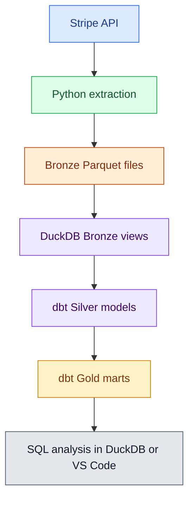

# Open Financial Lakehouse: Stripe Analytics Pipeline

Local-first data platform that extracts Stripe test-mode data, stores the raw API responses as Bronze Parquet files, exposes them through DuckDB, and transforms them with dbt into Silver and Gold analytics models.

## Architecture



## Layers

Bronze keeps the raw Stripe JSON payloads plus audit metadata such as `load_id`, `extracted_at`, and `source`. This layer is append-only and can contain repeated records from multiple loads.

Silver cleans and deduplicates the Stripe objects. These models cast JSON fields into typed columns and keep one latest version per Stripe object.

Gold contains business-ready tables for analysis, such as customers, revenue/payments, and cash flow.

## Main Folders

```text
src/stripe_lakehouse/
  Core Python package for configuration, Stripe API access, state handling,
  Bronze writing, and extraction strategies.

scripts/
  Runnable commands for seeding Stripe test data, extracting data,
  validating Bronze files, and creating DuckDB Bronze views.

dbt_finance_platform/
  dbt project with Silver staging models and Gold marts.

data/
  Local generated lakehouse data. This folder is ignored by Git.
```

## Documentation

- [Architecture](docs/architecture.md)
- [Local setup](docs/local_setup.md)
- [Airflow](docs/airflow.md)

## Useful Commands

### Run With Airflow And Docker

Build the local Airflow image:

```bash
docker compose build
```

Initialize Airflow metadata tables and create the local admin user:

```bash
docker compose up airflow-init
```

Start the Airflow webserver and scheduler:

```bash
docker compose up airflow-webserver airflow-scheduler
```

Then open Airflow at:

```text
http://localhost:8080
```

Login:

```text
username: airflow
password: airflow
```

The DAG is named `stripe_lakehouse_pipeline`.

Docker runs Airflow in isolated containers, but the project folder is mounted into the containers at `/opt/airflow/project`. That means code changes made in VS Code are visible to Airflow without rebuilding the image. Rebuild the image only when Python dependencies change.

### Run Manually

Run all Stripe extractions:

```bash
/Users/diegolutckmeier/miniconda3/envs/sparkenv/bin/python scripts/extract_all.py
```

Validate Bronze files:

```bash
/Users/diegolutckmeier/miniconda3/envs/sparkenv/bin/python scripts/validate_bronze.py
```

Create DuckDB Bronze views:

```bash
/Users/diegolutckmeier/miniconda3/envs/sparkenv/bin/python scripts/create_duckdb_bronze_views.py
```

Run dbt:

```bash
cd dbt_finance_platform
DBT_PROFILES_DIR=. /Users/diegolutckmeier/miniconda3/envs/sparkenv/bin/dbt run
DBT_PROFILES_DIR=. /Users/diegolutckmeier/miniconda3/envs/sparkenv/bin/dbt test
```

## Current Models

Silver:

- `stg_stripe_customers`
- `stg_stripe_payment_intents`
- `stg_stripe_charges`
- `stg_stripe_balance_transactions`
- `stg_stripe_payouts`
- `stg_stripe_balance`

Gold:

- `dim_customers`
- `fct_payments`
- `fct_cash_flow`

## Notes

This version intentionally uses local files and DuckDB instead of a cloud warehouse. That keeps the project easier to learn, cheaper to run, and still close to the shape of a real lakehouse pipeline.
