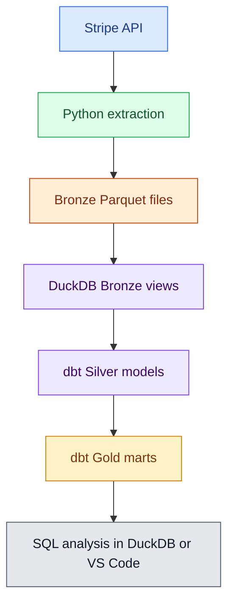

# Architecture

This project is a local-first financial lakehouse built around Stripe test-mode data.

## Current Flow

## Technology Roles

Stripe is the source system. The project reads customers, payment intents, charges, payouts, balance transactions, and balance snapshots from the Stripe API.

Python handles extraction, state management, Bronze row creation, validation, and DuckDB Bronze view creation.

Parquet is the Bronze storage format. Bronze keeps raw API JSON plus audit fields such as `load_id`, `source`, and `extracted_at`.

DuckDB is the local analytical database. It reads Parquet files and stores dbt-created Silver and Gold models.

dbt owns the transformation layer. It converts raw Bronze JSON into typed, deduplicated Silver models and business-ready Gold marts.

Airflow orchestrates the pipeline. It runs the extraction, validation, DuckDB view creation, dbt run, and dbt test steps in order.

Docker runs Airflow in isolated local containers.

## Medallion Layers

Bronze is raw and append-only. It is used for replay, auditability, and schema flexibility.

Silver is clean and deduplicated. It is used for reliable source-level analysis.

Gold is business-ready. It is used for reporting and analytics.

## Future Additions

Snowflake can replace or complement DuckDB as the cloud warehouse.

GitHub Actions can run checks in CI/CD.

Great Expectations or Soda can add stronger data quality checks.

Power BI, Tableau, or Evidence can be added as a BI layer.
